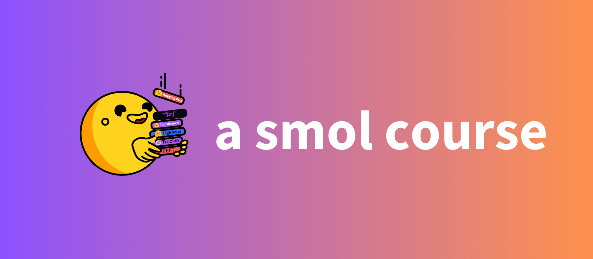

# a smol course

This is a practical course on aligning language models for your specific use case. It's a handy way to get started with aligning language models, because everything runs on most local machines. There are minimal GPU requirements and no paid services. The course is built around the [SmolLM3](https://huggingface.co/blog/smollm3) and [SmolVLM2](https://huggingface.co/blog/smolvlm2) models, but the skills you'll learn can be applied to larger models or other small LLMs/VLMs as well.

    <h2>smol course v2 is live!</h2>
    
This course is open and peer reviewed. To get involved with the course <strong>open a pull request</strong> and submit your work for review. Here are the steps:

    <ol>
        <li>Follow the <a href="https://huggingface.co/smol-course">Hugging Face Hub org</a></li>
        <li>Read the material, make changes, do the exercises, add your own examples.</li>
        <li>Submit a model to the leaderboard</li>
        <li>Climb the leaderboard</li>
    </ol>
    
This should help you learn and to build a community-driven course that is always improving.

## Future of this course

This course will soon be re-released on Hugging Face Learn! Stay tuned for updates.

## Course Outline

This course provides a practical, hands-on approach to working with small language models, from initial training through to production deployment.

| # | Topic | Description | Released |
| - | ----- | ----------- | -------- |
| 1 | Instruction Tuning | Supervised fine-tuning, chat templates, instruction following | ✅ |
| 2 | Evaluation | Benchmarks and custom domain evaluation | ✅ |
| 3 | Preference Alignment | Aligning models to human preferences with algorithms like DPO. | ✅ |
| 4 | Vision Language Models | Adapt and use multimodal models | ✅ |
| 5 | Reinforcement Learning | Optimizing models with based on reinforcement policies. | October 2025 |
| 6 | Synthetic Data | Generate synthetic datasets for custom domains | November 2025 |
| 7 | Award Ceremony | Showcase projects and celebrate | December 2025 |

## Why Small Language Models?

While large language models have shown impressive capabilities, they often require significant computational resources and can be overkill for focused applications. Small language models offer several advantages for domain-specific applications:

- **Efficiency**: Require significantly less computational resources to train and deploy
- **Customization**: Easier to fine-tune and adapt to specific domains
- **Control**: Better understanding and control of model behavior
- **Cost**: Lower operational costs for training and inference
- **Privacy**: Can be run locally without sending data to external APIs
- **Green Technology**: Advocates efficient usage of resources with reduced carbon footprint
- **Easier Academic Research Development**: Provides an easy starter for academic research with cutting-edge LLMs with less logistical constraints

## Prerequisites

Before starting, ensure you have the following:
- Basic understanding of machine learning and natural language processing.
- Familiarity with Python, PyTorch, and the `transformers` library.
- Access to a pre-trained language model and a labeled dataset.

## v1 of the course

The first version of the course used GithHub markdown and Jupyter notebooks. You can find it in the [v1](./v1) directory.

